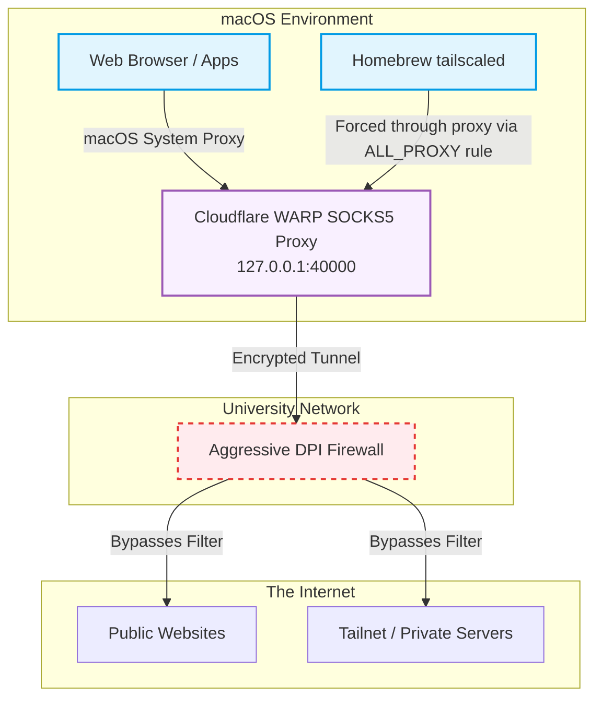

---
{"dg-publish":true,"dg-path":"TailscaleWARP/Making Warp and Tailscale works together.md","permalink":"/tailscale-warp/making-warp-and-tailscale-works-together/","title":"The Ultimate Guide to Bypassing Firewalls with Tailscale and Cloudflare WARP on macOS","tags":["networking","tailscale","macos","cybersecurity","tutorial","⚙️/pas/architecture/peer","Cloudflare"],"dg-note-properties":{"title":"The Ultimate Guide to Bypassing Firewalls with Tailscale and Cloudflare WARP on macOS","tags":["networking","tailscale","macos","cybersecurity","tutorial","⚙️/pas/architecture/peer","Cloudflare"],"cssclasses":["cornell-border","cornell-left","cornell-livepreview","wide-page"]}}
---


# The Ultimate Guide to Bypassing Firewalls with Tailscale and Cloudflare WARP on macOS

If you’ve ever tried to connect to your personal servers on a restrictive university or corporate Wi-Fi network, you've likely encountered Deep Packet Inspection (DPI) firewalls. These firewalls actively block WireGuard UDP packets, completely severing your Tailscale connection.

If you search the web, the "accepted" solution is to run Tailscale inside Cloudflare WARP. However, if you are on a Mac, you'll quickly discover a massive networking headache: **they usually conflict, break your routing, or simply fail to bypass the firewall.**[^4]

In this tutorial, I'll show you exactly how I engineered Cloudflare WARP and Tailscale to work in *flawless synergy* on macOS. Not only does this setup bypass the most aggressive captive portals, but it also secures your public Wi-Fi traffic without any routing loops.

> [!summary] TL;DR
> We will delete the Mac App Store version of Tailscale, install the Homebrew standalone daemon, set Cloudflare WARP to a local SOCKS5 proxy, and use macOS's `networksetup` to force browser traffic through the tunnel.

## Architecture: How the Synergy Works



## The Core Problem: Why the Mac App Store Version Fails

When you install Tailscale from the Mac App Store, it utilizes Apple's official `NetworkExtension` framework. To prevent VPN routing loops, Apple's framework forces the application to bind directly to the physical Wi-Fi interface (`en0`)[^1]. 

This means that even if you have Cloudflare WARP running in the background, your Tailscale traffic **completely bypasses** the WARP tunnel. Your WireGuard packets hit the university firewall head-on and get immediately dropped. 

> [!warning] The CLI Wrapper Trap
> Even if you run `tailscale up` in your terminal, the macOS CLI command silently aliases to the App Store's GUI network extension. You cannot fix this via the GUI app.

## Step-by-Step Implementation Guide
To achieve true synergy, we have to strip away Apple's rigid sandbox restrictions and drop down to the command line.

### Step 1: Ditch the App Store GUI
First, we need to completely eradicate the GUI version so it stops hijacking our terminal commands.
1. Force quit the Tailscale app.
2. Delete `/Applications/Tailscale.app`.
3. Clear out the hidden preferences and network extension data:
```bash
rm -rf ~/Library/Containers/io.tailscale.ipn.macsys
rm -rf ~/Library/Group\ Containers/io.tailscale.ipn.macsys
rm -f ~/.local/bin/tailscale
```
> [!Cue] update command
> brew update && brew upgrade

Now, install the raw, standalone Linux-style daemon via Homebrew:
```bash
brew install tailscale
```

### Step 2: Configure Cloudflare WARP as a Local Proxy
Instead of running Cloudflare WARP as a full system VPN (which conflicts with Tailscale's routing table), we will put it into **Proxy Mode**. This creates a local SOCKS5 tunnel.

Open your terminal and run:
```bash
warp-cli mode proxy
```
*This exposes a secure SOCKS5 proxy on `127.0.0.1:40000`.*[^2]

### Step 3: Inject the Proxy into Tailscale
Now, we need to launch our Homebrew `tailscaled` daemon and force it to route its packets *through* the WARP SOCKS5 proxy. 

> [!info] What is ALL_PROXY?
> Think of an "environment variable" (like `ALL_PROXY`) as a set of strict instructions you whisper to an application right before it wakes up. 
> 
> By injecting `ALL_PROXY="socks5://127.0.0.1:40000"` into Tailscale as it starts, we are explicitly telling it: *"Do not connect directly to the internet! You must take all your traffic and shove it directly into the Cloudflare WARP tunnel we just created."*

Create a startup script (e.g., `start_tailscale.sh`) with the following execution command:
```bash
sudo env ALL_PROXY="socks5://127.0.0.1:40000" \
     HTTPS_PROXY="socks5://127.0.0.1:40000" \
     HTTP_PROXY="socks5://127.0.0.1:40000" \
     NO_PROXY="localhost,127.0.0.1,::1,*.local" \
     $(brew --prefix)/bin/tailscaled
```

> [!danger] Watch out for macOS Sudo!
> Using `sudo -E` to preserve environment variables does **not** work on macOS for proxy variables due to security policies. You *must* inject the environment variables inline (`sudo env ALL_PROXY=...`) as shown above.

Once the daemon is running in the background, open a new terminal tab to authenticate:
```bash
$(brew --prefix)/bin/tailscale --socket=/var/run/tailscaled.socket up
```
*(Note: The `--socket` flag is mandatory to prevent the CLI from searching for the deleted App Store socket!)*

### Step 4: The "Magic Command" for Web Browsing
At this point, Tailscale successfully reaches your personal servers by tunneling inside WARP. However, because the Homebrew daemon lacks Apple Network Extension privileges, it cannot override your Mac's default route for regular web browsing (like Safari or Chrome)[^3].

To force your standard web traffic to bypass the DPI firewall, use this native macOS networking command to enable the system-wide SOCKS proxy on your Wi-Fi interface:
```bash
sudo networksetup -setsocksfirewallproxy Wi-Fi 127.0.0.1 40000 off
sudo networksetup -setsocksfirewallproxystate Wi-Fi on
```

## The Result: Perfect Synergy
By separating the routing logic, we have built an architecture where the two tools complement each other perfectly:
- **Tailscale** seamlessly handles your private server traffic (Split Tunnel).
- **Cloudflare WARP** encrypts and handles all your public web browsing.

If you ever want to turn off the proxy when you get home, simply run:
`sudo networksetup -setsocksfirewallproxystate Wi-Fi off`

In my experience, when standard GUI applications conflict on macOS or when companies like Cloudflare dumbing down its GUI and hide advanced configurations from their desktop apps, (forcing you to resort to the CLI)...breaking down the architecture into its raw command-line components is the ultimate way to regain control of your networking.

### References
script file: `start_tailscale_proxy.sh`
#example adding 👇 in `.zshrc` & typed in `PnC` in terminal to start.
```
# Brew Tailscale
alias tailscale="/opt/homebrew/bin/tailscale --socket=/var/run/tailscaled.socket"
alias PnC="~/PKMxKB/on/Pas/TailscaleWARP/start_tailscale_proxy.sh"
```

---

[^1]: Apple's `NEPacketTunnelProvider` framework enforces strict binding rules to prevent recursive routing loops, bypassing secondary generic VPNs.
[^2]: Cloudflare WARP proxy mode documentation: [Cloudflare Developers](https://developers.cloudflare.com/warp-client/setting-up/proxy-mode/)
[^3]: The `utun` interface created by the standalone `tailscaled` daemon on macOS is strictly treated as a split-tunnel by the OS unless authorized via a System Extension profile.
[^4]: As widely documented across [GitHub Issues]([https://github.com/tailscale/tailscale/issues](https://github.com/tailscale/tailscale/issues?q=is%3Aissue%20state%3Aopen%20cloudflare%20warp)) and community [forums](https://www.reddit.com/r/Tailscale/search/?q=cloudflare+warp), running Cloudflare WARP and Tailscale simultaneously typically results in a "routing takeover" where both network extensions fight for control over the OS's DNS and routing tables, leading to a complete connection drop.
